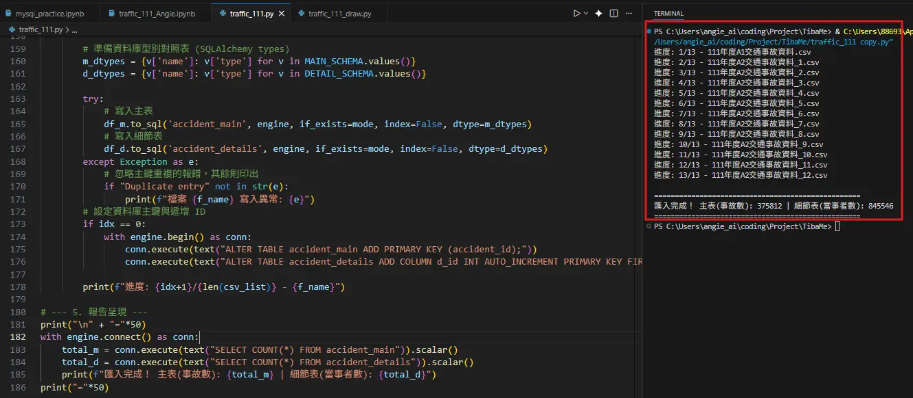
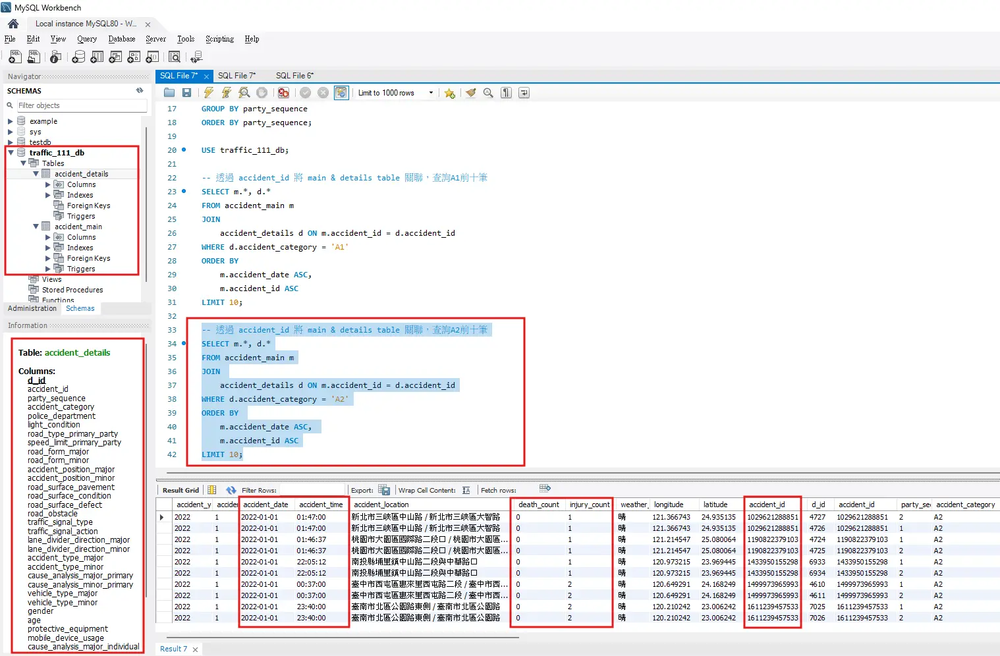
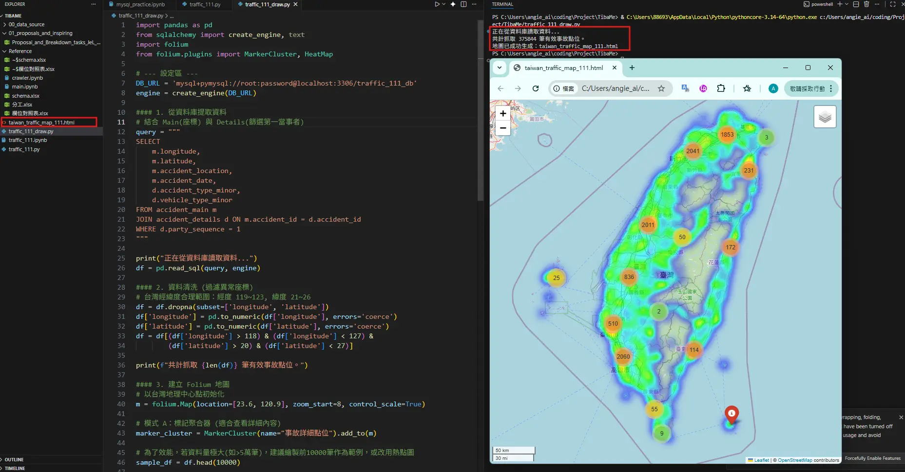
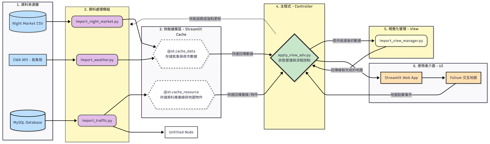
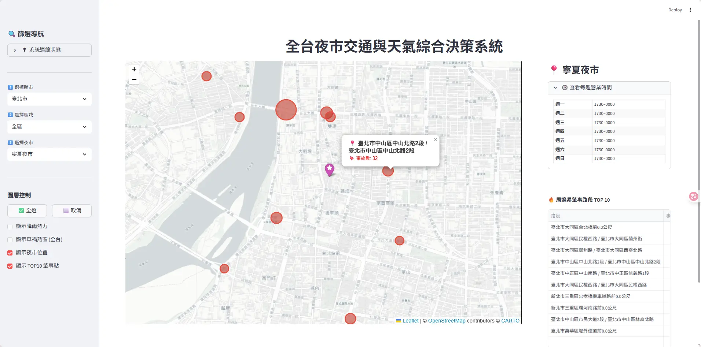
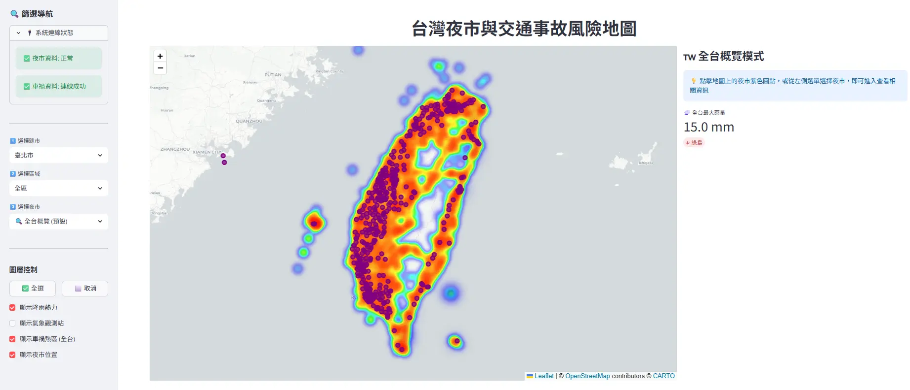
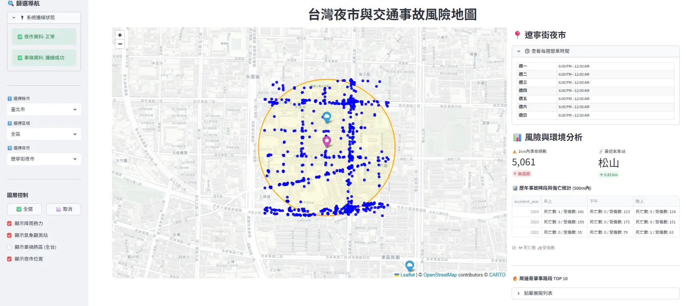
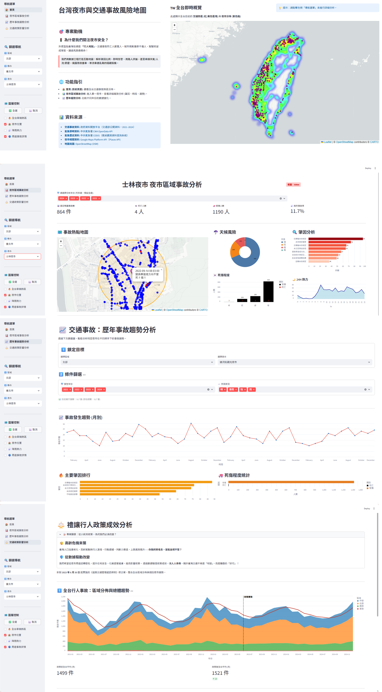

## Spatial Analysis Project (Traffic × Weather × Night Market)
專案目標：整合交通事故、即時氣象、夜市資料，做互動式地圖呈現與空間分析（Folium + Streamlit）[WIP]

---

## Quick Start (Local) - How to Run
- 目前實作項目已遷移至 Poetry 管理環境
- 安裝環境：poetry install
- 變數設定：參考 .env.template 建立 .env
- 執行專案：poetry run streamlit run src/r_app.py

---

## Tech Stack
- Python, Pandas（資料處理）
- MySQL（資料儲存與查詢驗證）
- Folium / Leaflet（互動式地圖輸出）
- Streamlit（前端互動與展示）
- Airflow - Redis (ongoing...)

---
## Notes / Dev Logs
-  Week1: Traffic accidents crawler → MySQL ingestion + 初版 Folium 地圖
-  Week2: Cross-domain integration (Traffic + Weather + Night Market) + Streamlit → 展示與快取研究
-  Week3: Performance Optimization & Regional Risk Analysis (1.5M+ Data)
-  Week4: Architecture Standardization and Data Insights

---

## Current Status (已實作)
### Week1: Traffic accidents crawler → MySQL ingestion + 初版 Folium 地圖
- 交通事故資料：爬取/解壓縮/清洗，匯入 MySQL，並完成初步查詢驗證

- Demo / Screenshot:





### Week2: Cross-domain integration (Traffic + Weather + Night Market) + Streamlit
- 初版視覺化：使用 Folium 產出事故點位地圖（HTML）
- 跨域整合：夜市 CSV（座標/多邊形）＋ 氣象局 API ＋ MySQL 事故資料，完成模組化整合並以 Streamlit 呈現
- 效能與穩定性：嘗試導入 Streamlit 快取（@st.cache_data / @st.cache_resource），並修正「Map container is already initialized」問題（動態 key）
  Pipeline Overview (模組分工)
    - import_night_market.py：夜市資料清洗整理（座標與多邊形）
    - import_weather.py：氣象局 API 取得氣象資料
    - import_traffic.py：從 MySQL 抓取交通事故資料
    - import_view_manager.py：視覺呈現邏輯（底圖、圖層、側邊欄、Popup HTML）
    - apply_view_adv.py（或 main.py）：整合上述模組並用 Folium 繪圖，透過 Streamlit 顯示
- System Flowchart / Data Pipeline:


- Demo / Screenshot:



### Week3: Performance Optimization & Regional Risk Analysis (1.5M+ Data)
- 完成資料來源遷移與安全性提升：
  - 成功將資料從 Local MySQL/.csv 遷移至 GCP VM -> MYSQL
  - 實作 db_utils.py 統一管理連線邏輯，並透過 SSH Tunnel 確保資料傳輸安全

- 效能優化
  - 全台概覽模式：實作 **SQL 格網聚合技術** (`GROUP BY ROUND(lat, 2)`)，將 150 萬筆原始資料轉化為輕量級熱力圖數據
  - 對單一夜市半徑搜尋，設定 LIMIT 800 並按時間排序（只抓最新），確保地圖標記清晰且載入快速
  - 快取機制：導入 st.cache_data 與 st.cache_resource，大幅減少重複的 SQL 查詢與資料庫連線，將地圖切換時間從20~30秒縮短至3秒

- UI/UX優化
  - 車禍事故資訊 - 運用 Pandas Pivot Table 將直式資料轉為橫向報表，並新增「各年度統計」

- Demo / Screenshot:



### Week4: Architecture Standardization and Data Insights
- **系統架構重構 **：採用 **R / C / V 分層設計**
    - 考量專案擴展性，將檔案結構由傳統 ETL 命名轉向 **Layered Architecture**：
        - **R (Run)**：基礎設施連線與入口（如 `r_cache.py`, `r_app.py`）
        - **C (Core Service)**：計算邏輯與跨來源資料整合
        - **V (View)**：UI 介面呈現與地圖渲染
    - 導入 Streamlit **多頁面架構 **：運用 `pages/` 資料夾實現功能模組化
```
├── r_app.py                  # 主程式，只有指揮邏輯
├── r_cache.py                # Redis 快取
├── c_data_service.py         # 資料層 (整合了 NightMarket, Weather, Traffic)
├── c_ui.py                   # 介面層 (只包含跟 **Streamlit** 和 **Folium** 有關的程式碼) (原 import_view_manager.py)
├── c_db.py                   # 資料庫連線
├────── pages/                # Streamlit 自動多頁導覽資料夾
│       ├─ v_dashboard.py       # 夜市區域分析
│       ├─ v_hist_trend.py      # 歷年趨勢分析
└────── └─ v_policy_impact.py   # 禮讓行人政策成效分析
```

- **效能與資料工程優化**
    - **MySQL 索引優化**：於事故主表建立 `idx_lat_lon` 座標索引，配合 **BBOX (地理圍欄)** 實現效能優化
    - **資料庫視圖 (View)**：建立 `view_accident_analysis` 預先關聯「主表 (Main)」、「肇因 (Process)」與「當事人 (Human)」，降低前端 SQL 複雜度
    - **Redis 分散式快取**：實作 **「DB 運算 ➔ Redis 存儲 ➔ Python 調用」** 流程，減輕雲端資料庫 I/O 負擔並縮短地圖載入時間
- **多維度數據洞察**
    - 整合 **Plotly / Altair** 繪製「事故主因圓餅圖」、「影響因素長條圖」及「歷年趨勢折線圖」
- **前端頁面擴增**
	- 運用 Streamlit 原生 `pages/` 架構，擴增歷年趨勢分析(`v_hist_trend.py`) 以及禮讓行人政策成效分析 (`v_policy_impact.py)` 等獨立頁面
- **Demo / Screenshot**:


---

## Next Steps
### Week5: (2/28)
- [前端優化] 夜市區域分析頁面功能客製化：實作特定區域(距離)之互動式篩選
- [效能深化] 評估 MySQL View 轉實體表 (Materialized Table) 之可行性：測試實體化存取對大規模空間查詢的加速成效
- [容器化初探] 實作 Docker Compose 基礎配置：封裝 Streamlit 應用環境，確保本地開發與伺服器環境一致性

### Week6: (3/3 / 3/6)
- [自動化排程] 整合 Airflow 與 Redis：實作自動化 ETL 管線，定時更新 Redis，確保分析時效性
- [系統部署] 於 GCP VM 執行 Docker Compose 環境部署：完成前端頁面橋接，並於雲端 Docker 容器中穩定運行網頁服務

### Week7: (3/08)
- [成果整合] 系統穩定度最終測試與 UI/UX 調校：確保跨領域數據（事故、氣象、夜市）在容器環境下之整合流暢度
- [技術彙整] 製作專題技術簡報docs: update README for Week 4
