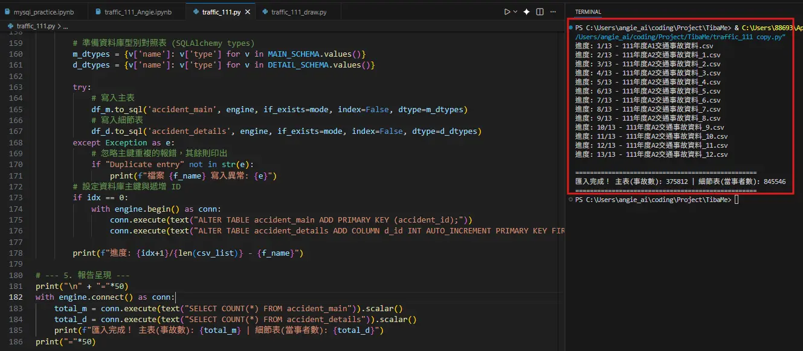
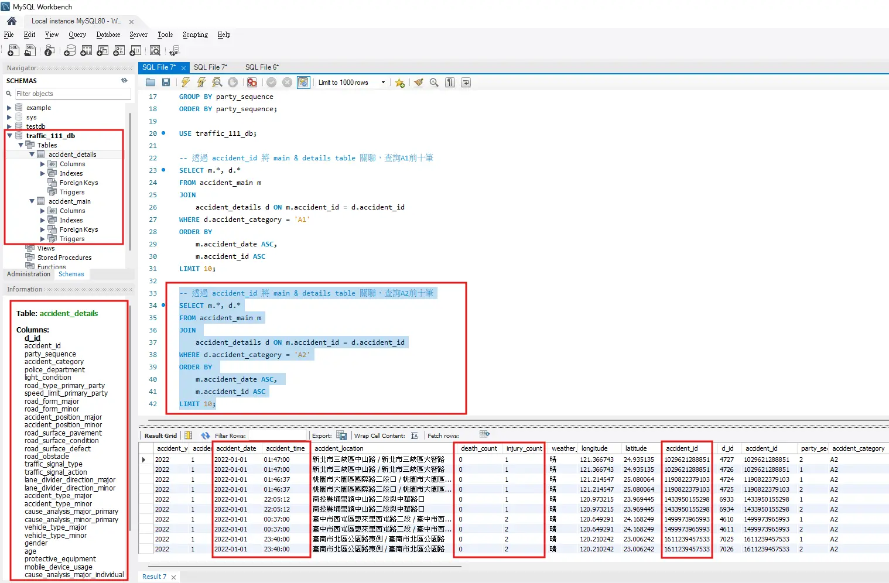
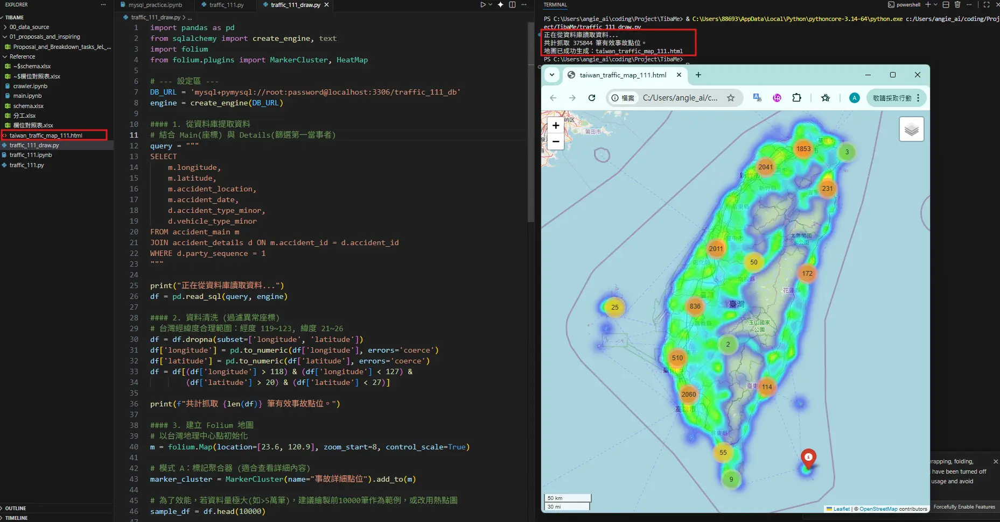

#### 可與團隊討論的事項
- PK的依據 (目前我是以hashlib生成ID <參照方式: 發生日期+發生時間+發生地點+經度+緯度>)
- 時間的定義,仍需思考 (例如:111年A2-1月, 時間呈現有22/200/722....我有遇到不好定義的問題)
- MySQL關聯表結構 (可視後續開發需求優化)
#### 程式碼設計邏輯
1. 環境設定、2. 定義 Schema、3. 資料清洗、4. MySQL匯入、5.MySQL檢查與查詢、6. 經緯度地圖繪製(純屬好奇嘗試)
#### 我的學習要點
1. 自動化爬取網站資訊
	- CSV檔被壓縮為ZIP, 需先解壓縮才能進行資料清洗
2. 資料清洗 
	- 定義 Schema
	- 日期時間統一 (已先初步進行正規化處理)
	- 自動化建立 PK (湊叢)
	- 呈現執行結果 ==(如附圖1)==
3. 資料庫建立 & 連結python & MySQL查詢 ==(如附圖2)==
	- 確定各欄位資料型態與PK順利產生
	- 死亡/受傷分兩欄
	- 建立main_table & detail_table
	- 查詢匯入資訊，並進行初步查詢驗證
4. 匯出111年份經緯度地圖 (import Folium) ==(附圖3)==
	- Folium 是將 Python 的數據處理能力與 **Leaflet.js** 的地圖展示能力結合的函式庫。以Python 邏輯處理經緯度數據後，可生成一個互動式的 HTML 地圖網頁。
#### 備註
- MySQL各欄位的清洗結果, 需與團隊確認正確/清晰程度
- 自動化爬取"多年度"時, 資料爬取完整度亦需確認

##### 附圖1: Python執行結果

##### 附圖2:  MySQL 內容呈現

##### 附圖3: import folium, 產生111年全台各地的事故點(透過經緯度判別)

