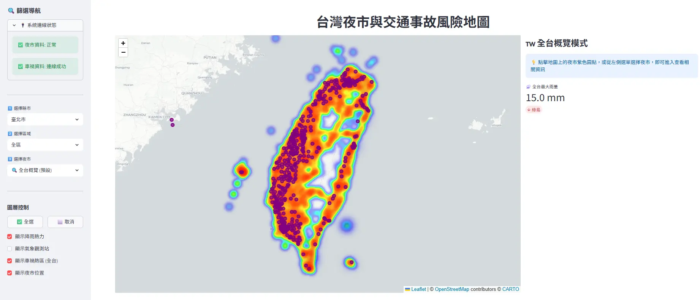

## Summary
#### 本週進度
1. 完成資料來源遷移與安全性提升
  - 成功將資料從 Local MySQL/.csv 遷移至 GCP VM -> MYSQL
  - 實作 db_utils.py 統一管理連線邏輯，並透過 SSH Tunnel 確保資料傳輸安全
2. 效能優化
  - 全台概覽模式：捨棄 LIMIT 2000 的原始資料抓取，改用 SQL Grid Aggregation，將1.5M筆車禍資料轉化為輕量級的熱力圖數據
  - 對單一夜市半徑搜尋，設定 LIMIT 800 並按時間排序（只抓最新），確保地圖標記清晰且載入快速
  - 快取機制：導入 st.cache_data 與 st.cache_resource，大幅減少重複的 SQL 查詢與資料庫連線，將地圖切換時間從20~30秒縮短至3秒
3. UI/UX優化
  - 車禍事故資訊 - 運用 Pandas Pivot Table 將直式資料轉為橫向報表，並新增「各年度統計」

#### Demo

#### 實作內容說明
##### 1. **資料庫連線設定(GCP VM ->MYSQL):
1. .env環境更新
2. 建立 【db_utils.py】，進行資料庫連線設定
3. 建立 【test_db_check.py】，進行連線測試

##### 2. 雲端資料遷移與架構重構
- 【import_night_market.py】 
	- 根據營業時間 (`wt`) 自動區隔「營運中」與「(其他)非營運」夜市，提升導航體驗
- 【import_traffic.py 】
	- 資料庫效能優化
		- **效能問題**：車禍總資料量達 **150 萬筆**，原始查詢 (Full Table Scan) 會導致 Python 連線逾時 (Timeout)。
		- **解決方案**：在資料庫端建立經緯度索引 (`CREATE INDEX idx_lat_lon`)
		- **執行成果**：空間搜尋速度從 **>30秒** 縮短至 **10秒內
		
	- 新增分析功能
		- **區域風險指標 (KPI)**：
			- 功能：`get_zone_stats`
			- 作用：計算指定座標（如士林夜市）方圓 N 公里內的**車禍總數** (例如：1km 內發生 2,680 起)。
			- 優勢：利用索引快速運算，不受繪圖數量限制 (Limit) 影響。
		- **事故分類統計 (Charts)**：
			- 功能：`get_nearby_top10`
			- 作用：統計範圍內的事故類型分佈 (例如：晴天 vs 雨天)
			
- 【import_weather_station.py】觀測站資料導入
	- 專責處理空間點位的氣象測站配對
    - 修正氣象觀測站圖層，直接連動天氣 API 資料，在地圖上即時呈現測站位置與當前雨量。
	- 修改 `import_traffic.py`：在地圖上加入「氣象觀測站」圖層
	
- 【import_view_manager.py】UI/UX優化
	- **`render_sidebar`**：新增**「顯示氣象觀測站」** 的勾選框 (Checkbox)
	- **`build_map`**：
	    - 修改 `traffic_global` 的接收方式（從 2 個變數改成 3 個）
	    - 加入將 `t_stations` (觀測站圖層) 疊加到地圖上的邏輯

#### 討論事項 (評估效能提升方向)
1. H3 (Uber 六角網格)評估
	- 目前使用 SQL 的 `ROUND(lat, 2)` 算方格 (這是 SQL 內建數學功能，完全不用動資料庫結構)
	- **H3**：
		- 資料庫看不懂經緯度對應的六角形 ID。需要寫一隻程式，把 150 萬筆資料跑一遍，算出每一筆對應的 `h3_index` (例如字串 `'8928308280fffff'`)，並存入新欄位
		- 如果資料庫還在建置中，每次匯入新資料都要重算
	- 前端渲染問題：
	    - 目前使用 Folium `HeatMap` 原生支援 `[lat, lon]`，以一行程式碼呈現
	    - **H3**：
		    - Folium 不支援直接畫 H3 字串。需要先把 H3 ID 轉回「六邊形的 6 個頂點座標 (GeoJSON Polygon)」，然後自己寫程式去定義顏色（例如：事故>50次塗深紅、<10次塗淺黃）
		    - 會需要寫大量的 JavaScript 或 Folium 樣式設定
2. Redis (快取資料庫) 評估
    - 目前使用 `st.cache_data`，這是 Streamlit 伺服器本身的記憶體 (RAM)，免費且設定只需一行 `@st.cache_data`
    - Redis
	    - 是一個「獨立的伺服器軟體」。需要去 GCP 租用 MemoryStore，或用 Docker 架設 Redis Container (須設定連線、防火牆、權限)
		    - GCP Memorystore for Redis (託管)
			    - 計費標準主要依據**容量大小 (GB)** 與**服務層級**，以小時計費
			    - 基本層級: 台灣機房 (`asia-east1`) 1GB 容量約 **$26 USD / 月** (約台幣 800 元)
			    - 標準層級: 台灣機房 1GB 容量約 **$65 USD / 月** (約台幣 2,000 元)
			- Docker 架設 (自管)
				- **極省方案：** 若使用 `e2-micro` (2 vCPU, 1GB RAM)，這在 GCP **免費層級 (Free Tier)** 範圍內，設定得當幾乎 **$0 元**
				- ==**穩定方案：** 若使用 `e2-small` (2 vCPU, 2GB RAM)，一個月約 **$14 USD** (約台幣 450 元)==
				- **Spot 實例：** 若不介意機器偶爾重啟，可用 Spot VM，價格可再打 3-4 折 (約 $5 USD/月)
	    - 只能存「字串」或「二進位檔」。要把 Python 的 `DataFrame` 存進去，必須先轉碼 (Pickle/JSON)，拿出來再解碼

#### Next Step (下周實作目標)
- [架構評估] 持續優化地理空間索引 (H3 評估) 與 分散式快取 (Redis 導入規劃)
- [數據分析] 實作事故與天氣關聯性分析：鎖定特定夜市周邊觀測站之歷史氣象數據
- [視覺化] 導入多維度統計圖表 (Plotly/Altair)：包含事故主因(圓餅圖)、各項因素(長條圖)及歷年趨勢折線圖
- [前端優化] 整合即時天氣與夜市連動功能，支援自定義日期時間篩選
	- 事故 -> 觀測站 -> 歷史天氣 ->  (SQL -> Table) -> 前台
	- 統計數據 -> 加上年份
