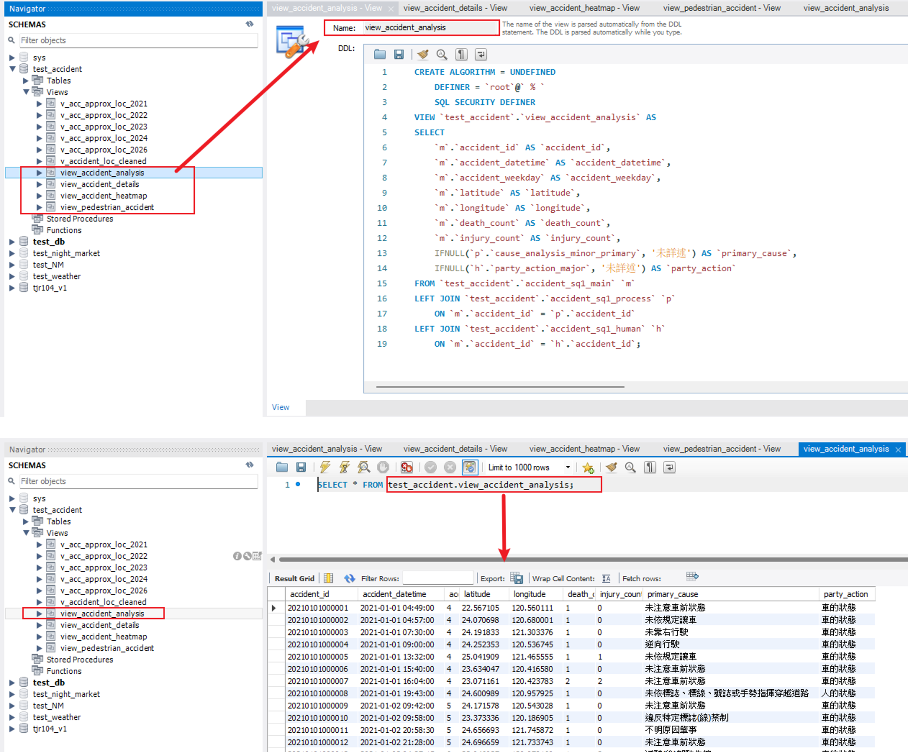
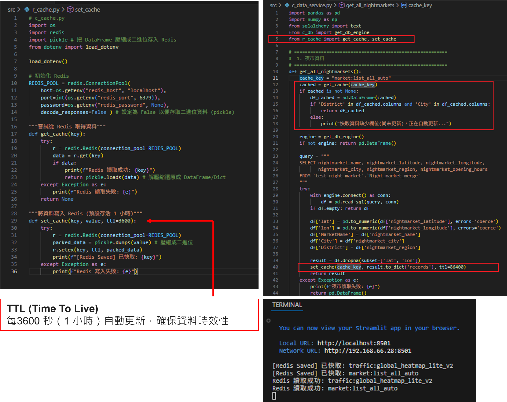

## Summary
#### 本週進度
- **系統架構重構**：採用 **R / C / V 分層設計**
    - 考量專案擴展性，將檔案結構由傳統 ETL 命名轉向 **Layered Architecture**：
    - 導入 Streamlit **多頁面架構 **：運用 `pages/` 資料夾實現功能模組化
- **效能與資料工程優化**
    - **MySQL 索引優化**：於事故主表建立 `idx_lat_lon` 座標索引，配合 **BBOX (地理圍欄)** 實現效能優化
    - **資料庫視圖 (View)**：建立 `view_accident_analysis` 預先關聯「主表 (Main)」、「肇因 (Process)」與「當事人 (Human)」，降低前端 SQL 複雜度
    - **Redis 分散式快取**：實作 **「DB 運算 ➔ Redis 存儲 ➔ Python 調用」** 流程，減輕雲端資料庫 I/O 負擔並縮短地圖載入時間
- **多維度數據洞察**
    - **專業統計圖表**：整合 **Plotly / Altair** 繪製「事故主因圓餅圖」、「影響因素長條圖」及「歷年趨勢折線圖」
- **前端頁面擴增**
	- 運用 Streamlit 原生 `pages/` 架構，擴增歷年趨勢分析(`v_hist_trend.py`) 以及禮讓行人政策成效分析 (`v_policy_impact.py)` 等獨立頁面

#### 實作細節與議題排解
- **系統架構重構**：採用 **R / C / V 分層設計**
    - 考量專案擴展性，將檔案結構由傳統 ETL 命名轉向 **Layered Architecture**：
        - **R (Run)**：基礎設施連線與入口（如 `r_cache.py`, `r_app.py`）
        - **C (Core Service)**：計算邏輯與跨來源資料整合
        - **V (View)**：UI 介面呈現與地圖渲染
    - 導入 Streamlit **多頁面架構 **：運用 `pages/` 資料夾實現功能模組化
```
Project_Root/
├── r_app.py                  # [Controller] 主程式，只有指揮邏輯，沒有實作細節
├── r_cache.py                # [Infra]  Redis 快取
├── c_data_service.py         # [Model]   資料層 (整合了 NightMarket, Weather, Traffic)
├── c_ui.py                   # [View]    介面層 (只包含跟 **Streamlit** 和 **Folium** 有關的程式碼) (原 import_view_manager.py)
├── c_db.py                   # [Infra]   資料庫連線
├────── pages/                # [View] Streamlit 自動多頁導覽資料夾
│       ├─ v_dashboard.py     # 夜市區域分析
│       ├─ v_hist_trend.py    # 歷年趨勢分析
└────── └─ v_policy_impact.py # 禮讓行人政策成效分析
```

- **效能與資料工程優化**
    - **MySQL 索引優化**：
		- **全台概覽優化**：在全台模式下，用 View 將座標簡化（取到小數點後兩位 $0.01^\circ \approx 1.1km$），這讓傳輸給前端的資料量從 150 萬筆降到約 1 萬筆格點
		- **資料庫View**：建立 `view_accident_analysis` 預先關聯「主表 (Main)」、「肇因 (Process)」與「當事人 (Human)」，降低前端 SQL 複雜度
		- 於事故主表建立 `idx_lat_lon` 座標索引，配合 **BBOX (地理圍欄)** 實現效能優化
		- 運用索引（Index）直接跳到這 150 萬筆中的特定位置，只抓出該夜市方圓 1km 內的幾百筆事故


- **Redis 分散式快取**：實作 **「DB 運算 ➔ Redis 存儲 ➔ Python 調用」** 流程，減輕雲端資料庫 I/O 負擔並縮短地圖載入時間
	- 底層工具 (r_cache.py)：
		- 負責與 Redis Server 連線，並定義了 get_cache（讀取）與 set_cache（寫入）兩個核心函式
		- 使用 pickle 將 Python 的 DataFrame 或字典壓縮成二進位格式，以優化存儲空間
	- 應用邏輯 (c_data_service.py)：
		- 「先查快取，後查資料庫」的實際應用
		- 程式會先檢查 Redis 是否已有資料；若無，則向資料庫請求，並在回傳結果前將資料寫入 Redis 以供下次使用


- **多維度數據洞察**
    - **專業統計圖表**：整合 **Plotly / Altair** 繪製「事故主因圓餅圖」、「影響因素長條圖」及「歷年趨勢折線圖」

- 前端頁面擴增
	- 運用 Streamlit 原生 `pages/` 架構，擴增歷年趨勢分析(`v_hist_trend.py`) 以及禮讓行人政策成效分析 (`v_policy_impact.py)` 等獨立頁面

#### Demo


#### Next Step (下周實作目標)
### Week5: (2/28)
- [前端優化] 夜市區域分析頁面功能客製化：實作特定區域(距離)之互動式篩選
- [效能深化] 評估 MySQL View 轉實體表 (Materialized Table) 之可行性：測試實體化存取對大規模空間查詢的加速成效
- [容器化初探] 實作 Docker Compose 基礎配置：封裝 Streamlit 應用環境，確保本地開發與伺服器環境一致性

### Week6: (3/3 / 3/6)
- [自動化排程] 整合 Airflow 與 Redis：實作自動化 ETL 管線，定時更新 Redis，確保分析時效性
- [系統部署] 於 GCP VM 執行 Docker Compose 環境部署：完成前端頁面橋接，並於雲端 Docker 容器中穩定運行網頁服務

### Week7: (3/08)
- [成果整合] 系統穩定度最終測試與 UI/UX 調校：確保跨領域數據（事故、氣象、夜市）在容器環境下之整合流暢度
- [技術彙整] 製作專題技術簡報docs: update README for Week 4